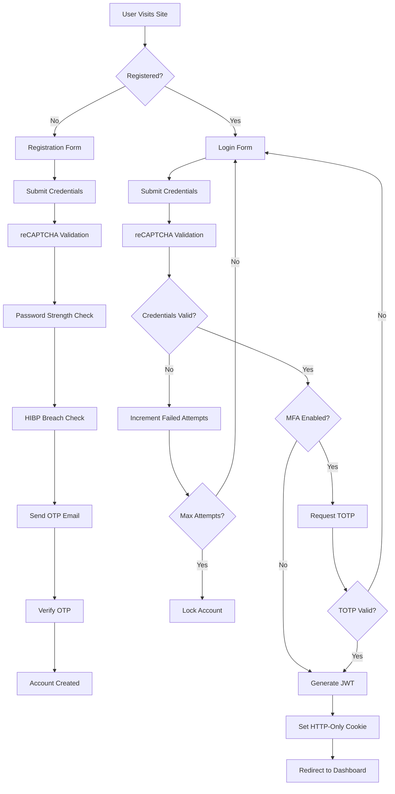

# 👑 CrownHour - Luxury Watch E-Commerce Platform

> A secure, full-stack MERN (MongoDB, Express, React, Node.js) e-commerce application for luxury watches with enterprise-grade security features.

[](https://opensource.org/licenses/ISC)
[](https://nodejs.org/)
[](https://www.mongodb.com/)

---

## 📋 Table of Contents

- [Features](#-features)
- [Security Features](#-security-features)
- [Tech Stack](#-tech-stack)
- [Prerequisites](#-prerequisites)
- [Installation](#-installation)
- [Environment Variables](#-environment-variables)
- [Running the Application](#-running-the-application)
- [API Endpoints](#-api-endpoints)
- [Project Structure](#-project-structure)
- [Security Implementation](#-security-implementation)
- [Contributing](#-contributing)
- [License](#-license)

---

## ✨ Features

### 🛍️ Customer Features

- **Browse Collections** - Explore luxury watch collections (Men's, Women's, Featured)
- **Advanced Search** - Filter and search products with multiple criteria
- **Shopping Cart** - Add items to cart with real-time inventory validation
- **Wishlist** - Save favorite watches for later purchase
- **Secure Checkout** - Integrated Stripe payment processing with PCI compliance
- **Order Tracking** - Real-time order status updates and delivery tracking
- **Reviews & Ratings** - Leave detailed product reviews with star ratings
- **Profile Management** - Update personal information and preferences

### 👨‍💼 Admin Features

- **Analytics Dashboard** - Comprehensive sales and user metrics
- **Product Management** - Full CRUD operations for watch inventory
- **Order Management** - Process and update order statuses
- **User Management** - Manage user accounts and permissions
- **Audit Logs** - Security event monitoring and compliance tracking
- **Review Moderation** - Approve, edit, or remove customer reviews

### 🔐 Authentication Features

- **Email/Password Registration** - Secure signup with OTP email verification
- **Google OAuth 2.0** - One-click login with Google accounts
- **Multi-Factor Authentication (MFA)** - TOTP-based 2FA with backup codes
- **Password Reset** - Secure password recovery via email
- **Session Management** - Automatic idle timeout and logout
- **Device Management** - Logout from all devices remotely

---

## 🔒 Security Features

| Feature | Implementation | Description |
|---------|----------------|-------------|
| 🔐 **HTTPS/SSL** | TLS 1.3 | End-to-end encryption with modern cipher suites |
| 🍪 **Secure Cookies** | HTTP-Only + SameSite | JWT tokens protected from XSS attacks |
| 🛡️ **CSRF Protection** | Double-Submit Cookie | Token rotation with state validation |
| 📱 **MFA/2FA** | TOTP (RFC 6238) | Time-based one-time passwords with backup codes |
| ⏱️ **Rate Limiting** | Express Rate Limit | Sliding window algorithm for API protection |
| 🔒 **Account Locking** | Progressive Delays | Auto-lock after 5 failed login attempts |
| 🚫 **IP Blocking** | Automated Blacklist | Block malicious IPs after sustained abuse |
| 🔑 **Password Security** | Bcrypt (cost 12) | Salted hashing + breach detection via HIBP API |
| 🔐 **Field Encryption** | AES-256-GCM | Encrypt PII at rest with authenticated encryption |
| 🎫 **Token Versioning** | JWT Claims | Immediate session revocation across all devices |
| ✅ **Input Validation** | Zod + Joi | Client and server-side schema validation |
| 🧹 **XSS Prevention** | DOMPurify + CSP | Content sanitization and strict CSP headers |
| 💉 **SQL Injection Prevention** | Mongoose + Sanitization | Parameterized queries and input sanitization |
| 🛡️ **Security Headers** | Helmet.js | HSTS, X-Frame-Options, CSP, and more |
| 📝 **Audit Logging** | Winston | Comprehensive security event tracking |
| 🤖 **Bot Protection** | reCAPTCHA v3 | Intelligent bot detection on auth endpoints |
| 🔗 **OAuth Security** | State Parameter | PKCE flow with one-time token exchange |

---

## 🛠️ Tech Stack

### Frontend Technologies

| Technology | Purpose | Version |
|------------|---------|---------|
| ⚛️ **React** | UI Library | 18.x |
| ⚡ **Vite** | Build Tool & Dev Server | 5.x |
| 🎨 **Tailwind CSS** | Utility-First Styling | 3.x |
| 🐻 **Zustand** | State Management | 4.x |
| 🗺️ **React Router** | Client-Side Routing | 6.x |
| 📝 **React Hook Form** | Form Management | 7.x |
| ✔️ **Zod** | Schema Validation | 3.x |
| 📡 **Axios** | HTTP Client | 1.x |
| 💳 **Stripe.js** | Payment Integration | Latest |
| 🎯 **Lucide React** | Icon Library | Latest |

### Backend Technologies

| Technology | Purpose | Version |
|------------|---------|---------|
| 🟢 **Node.js** | Runtime Environment | 18.x+ |
| 🚂 **Express.js** | Web Framework | 4.x |
| 🍃 **MongoDB** | NoSQL Database | 6.x+ |
| 🦡 **Mongoose** | MongoDB ODM | 8.x |
| 🔑 **Passport.js** | OAuth Authentication | Latest |
| 🎫 **JSON Web Tokens** | Stateless Authentication | 9.x |
| 📧 **Nodemailer** | Email Service | 6.x |
| 🔐 **Speakeasy** | TOTP Generation | 2.x |
| 💳 **Stripe** | Payment Processing | Latest |
| ☁️ **Cloudinary** | Image CDN & Storage | Latest |

### Security Packages

| Package | Purpose |
|---------|---------|
| `helmet` | Security HTTP Headers |
| `cors` | Cross-Origin Resource Sharing |
| `express-rate-limit` | API Rate Limiting |
| `express-mongo-sanitize` | NoSQL Injection Prevention |
| `xss-clean` | XSS Attack Prevention |
| `hpp` | HTTP Parameter Pollution Prevention |
| `csrf-csrf` | CSRF Token Generation & Validation |
| `bcryptjs` | Password Hashing & Comparison |

---

## 📦 Prerequisites

Before you begin, ensure you have the following installed:

- **Node.js** >= 18.x ([Download](https://nodejs.org/))
- **MongoDB** >= 6.x ([Download](https://www.mongodb.com/try/download/community))
- **npm** or **yarn** package manager
- **SSL Certificates** (for HTTPS - instructions below)

---

## 🚀 Installation

### 1️⃣ Clone the Repository

```bash
[git clone https://github.com/AaryanBasnet/crownhour.git](https://github.com/AaryanBasnet/CrownHourProject.git)
cd crownhour
```

### 2️⃣ Install Backend Dependencies

```bash
cd backend
npm install
```

### 3️⃣ Install Frontend Dependencies

```bash
cd ../frontend
npm install
```

### 4️⃣ Generate SSL Certificates (Development)

```bash
# Create certificates directory
mkdir -p backend/certs
cd backend/certs

# Generate Root Certificate Authority (CA)
openssl genrsa -out rootCA.key 4096
openssl req -x509 -new -nodes -key rootCA.key -sha256 -days 1024 -out rootCA.pem \
  -subj "/C=US/ST=State/L=City/O=Organization/CN=Root CA"

# Generate Localhost Certificate
openssl genrsa -out localhost.key 2048
openssl req -new -key localhost.key -out localhost.csr \
  -subj "/C=US/ST=State/L=City/O=Organization/CN=localhost"

# Sign Certificate with CA
openssl x509 -req -in localhost.csr -CA rootCA.pem -CAkey rootCA.key \
  -CAcreateserial -out localhost.crt -days 500 -sha256 \
  -extfile <(printf "subjectAltName=DNS:localhost,IP:127.0.0.1")
```

> **💡 Note:** For production, use certificates from a trusted Certificate Authority like Let's Encrypt.

### 5️⃣ Configure Environment Variables

See the [Environment Variables](#-environment-variables) section below.

### 6️⃣ Seed the Database (Optional)

```bash
cd backend
npm run seed
```

This will populate your database with sample products and an admin user.

---

## 🔧 Environment Variables

### Backend Configuration (`backend/.env`)

Create a `.env` file in the `backend` directory with the following variables:

```env
# ===================================
# Server Configuration
# ===================================
NODE_ENV=development
PORT=5000

# ===================================
# Database
# ===================================
MONGODB_URI=mongodb://localhost:27017/crownhour

# ===================================
# Frontend URL (CORS)
# ===================================
FRONTEND_URL=https://localhost:5173

# ===================================
# Security - JWT
# ===================================
JWT_SECRET=your_jwt_secret_minimum_32_characters_long
JWT_EXPIRE=1h

# ===================================
# Security - Session
# ===================================
SESSION_SECRET=your_session_secret_minimum_32_characters

# ===================================
# Security - CSRF
# ===================================
CSRF_SECRET=your_csrf_secret_minimum_32_characters

# ===================================
# Security - Field Encryption
# Generate with: node -e "console.log(require('crypto').randomBytes(32).toString('hex'))"
# ===================================
ENCRYPTION_KEY=your_64_character_hexadecimal_encryption_key_here

# ===================================
# Security - Rate Limiting
# ===================================
RATE_LIMIT_WINDOW_MS=900000        # 15 minutes
RATE_LIMIT_MAX_REQUESTS=100

# ===================================
# Security - Account Locking
# ===================================
ACCOUNT_LOCK_MAX_ATTEMPTS=5
ACCOUNT_LOCK_DURATION=300000       # 5 minutes in milliseconds

# ===================================
# Security - IP Blocking
# ===================================
IP_BLOCK_MAX_ATTEMPTS=20
IP_BLOCK_DURATION=900000           # 15 minutes in milliseconds

# ===================================
# Google reCAPTCHA
# ===================================
RECAPTCHA_SECRET_KEY=your_recaptcha_secret_key_from_google

# ===================================
# Email Configuration (Gmail)
# ===================================
EMAIL_SERVICE=gmail
EMAIL_USER=your_email@gmail.com
EMAIL_PASSWORD=your_gmail_app_password
EMAIL_FROM=noreply@crownhour.com

# ===================================
# Stripe Payment Gateway
# ===================================
STRIPE_SECRET_KEY=sk_test_your_stripe_secret_key

# ===================================
# Cloudinary Image Storage
# ===================================
CLOUDINARY_CLOUD_NAME=your_cloud_name
CLOUDINARY_API_KEY=your_api_key
CLOUDINARY_API_SECRET=your_api_secret

# ===================================
# Google OAuth 2.0
# ===================================
GOOGLE_CLIENT_ID=your_google_client_id.apps.googleusercontent.com
GOOGLE_CLIENT_SECRET=your_google_client_secret
```

### Frontend Configuration (`frontend/.env`)

Create a `.env` file in the `frontend` directory:

```env
# Backend API URL
VITE_API_URL=https://localhost:5000/api

# Stripe Publishable Key
VITE_STRIPE_PUBLIC_KEY=pk_test_your_stripe_publishable_key

# Google reCAPTCHA Site Key
VITE_RECAPTCHA_SITE_KEY=your_recaptcha_site_key
```

### 🔑 Generating Secure Keys

```bash
# Generate a 256-bit encryption key (64 hex characters)
node -e "console.log(require('crypto').randomBytes(32).toString('hex'))"

# Generate a secure random string for secrets
node -e "console.log(require('crypto').randomBytes(64).toString('base64'))"
```

---

## ▶️ Running the Application

### Development Mode

Open two terminal windows:

**Terminal 1 - Backend Server:**

```bash
cd backend
npm run dev
```

The backend will start at `https://localhost:5000`

**Terminal 2 - Frontend Development Server:**

```bash
cd frontend
npm run dev
```

The frontend will start at `https://localhost:5173`

### Production Mode

```bash
# Build the frontend
cd frontend
npm run build

# The build output will be in frontend/dist

# Start the backend (serves static files in production)
cd ../backend
npm start
```

### 🎯 Access Points

- **Frontend**: https://localhost:5173
- **Backend API**: https://localhost:5000/api


> ⚠️ **Browser Warning**: Your browser will show a security warning for self-signed certificates. Click "Advanced" and proceed to localhost.

---

## 📡 API Endpoints

### 🔐 Authentication Endpoints

| Method | Endpoint | Description | Auth Required |
|--------|----------|-------------|---------------|
| POST | `/api/auth/register` | Register new user account | ❌ |
| POST | `/api/auth/verify-otp` | Verify registration OTP | ❌ |
| POST | `/api/auth/login` | Login with email/password | ❌ |
| POST | `/api/auth/logout` | Logout current session | ✅ |
| POST | `/api/auth/logout-all` | Logout from all devices | ✅ |
| GET | `/api/auth/me` | Get current user profile | ✅ |
| POST | `/api/auth/forgot-password` | Request password reset email | ❌ |
| PUT | `/api/auth/reset-password/:token` | Reset password with token | ❌ |
| GET | `/api/auth/google` | Initiate Google OAuth flow | ❌ |
| POST | `/api/auth/exchange-oauth-token` | Exchange OAuth token for JWT | ❌ |

### 🔐 Multi-Factor Authentication (MFA)

| Method | Endpoint | Description | Auth Required |
|--------|----------|-------------|---------------|
| POST | `/api/auth/mfa/enable` | Enable MFA and get QR code | ✅ |
| POST | `/api/auth/mfa/verify` | Verify MFA setup with TOTP | ✅ |
| POST | `/api/auth/mfa/disable` | Disable MFA | ✅ |
| GET | `/api/auth/mfa/backup-codes` | Get MFA backup codes | ✅ |
| POST | `/api/auth/mfa/regenerate-backup-codes` | Generate new backup codes | ✅ |

### 🛍️ Product Endpoints

| Method | Endpoint | Description | Auth Required |
|--------|----------|-------------|---------------|
| GET | `/api/products` | Get all products with filtering | ❌ |
| GET | `/api/products/:id` | Get single product details | ❌ |
| GET | `/api/products/category/men` | Get men's watches | ❌ |
| GET | `/api/products/category/women` | Get women's watches | ❌ |
| GET | `/api/products/featured` | Get featured products | ❌ |
| POST | `/api/products` | Create new product | ✅ Admin |
| PUT | `/api/products/:id` | Update product | ✅ Admin |
| DELETE | `/api/products/:id` | Delete product | ✅ Admin |

### 📦 Order Endpoints

| Method | Endpoint | Description | Auth Required |
|--------|----------|-------------|---------------|
| GET | `/api/orders` | Get user's order history | ✅ |
| GET | `/api/orders/:id` | Get single order details | ✅ |
| POST | `/api/orders` | Create new order | ✅ |
| PUT | `/api/orders/:id/pay` | Mark order as paid | ✅ |
| PUT | `/api/orders/:id/status` | Update order status | ✅ Admin |
| GET | `/api/orders/admin/all` | Get all orders | ✅ Admin |

### ⭐ Review Endpoints

| Method | Endpoint | Description | Auth Required |
|--------|----------|-------------|---------------|
| GET | `/api/reviews/product/:productId` | Get product reviews | ❌ |
| GET | `/api/reviews/top-rated` | Get top-rated reviews | ❌ |
| POST | `/api/reviews` | Create product review | ✅ |
| PUT | `/api/reviews/:id` | Update own review | ✅ |
| DELETE | `/api/reviews/:id` | Delete own review | ✅ |
| PUT | `/api/reviews/:id/moderate` | Moderate review | ✅ Admin |

### 🛒 Cart & Wishlist Endpoints

| Method | Endpoint | Description | Auth Required |
|--------|----------|-------------|---------------|
| GET | `/api/cart` | Get user's cart | ✅ |
| POST | `/api/cart` | Add item to cart | ✅ |
| PUT | `/api/cart/:itemId` | Update cart item quantity | ✅ |
| DELETE | `/api/cart/:itemId` | Remove item from cart | ✅ |
| DELETE | `/api/cart` | Clear entire cart | ✅ |
| GET | `/api/wishlist` | Get user's wishlist | ✅ |
| POST | `/api/wishlist` | Add item to wishlist | ✅ |
| DELETE | `/api/wishlist/:productId` | Remove item from wishlist | ✅ |

### 👨‍💼 Admin Endpoints

| Method | Endpoint | Description | Auth Required |
|--------|----------|-------------|---------------|
| GET | `/api/admin/users` | Get all users | ✅ Admin |
| GET | `/api/admin/audit-logs` | Get security audit logs | ✅ Admin |
| PUT | `/api/admin/users/:id/status` | Update user status | ✅ Admin |
| GET | `/api/admin/dashboard/stats` | Get dashboard statistics | ✅ Admin |

---

## 📁 Project Structure

```
CrownHourProject/
│
├── 📂 backend/
│   ├── 📂 certs/                    # SSL/TLS certificates
│   │   ├── localhost.crt
│   │   ├── localhost.key
│   │   └── rootCA.pem
│   │
│   ├── 📂 config/                   # Configuration files
│   │   ├── csrf.js                  # CSRF protection config
│   │   ├── database.js              # MongoDB connection
│   │   ├── env.js                   # Environment variable validation
│   │   └── passport.js              # OAuth strategies
│   │
│   ├── 📂 controllers/              # Route controllers
│   │   ├── authController.js
│   │   ├── productController.js
│   │   ├── orderController.js
│   │   ├── reviewController.js
│   │   └── adminController.js
│   │
│   ├── 📂 middleware/               # Express middleware
│   │   ├── auth.js                  # JWT authentication
│   │   ├── errorHandler.js          # Centralized error handling
│   │   ├── rateLimiter.js           # Rate limiting configs
│   │   ├── rbac.js                  # Role-based access control
│   │   └── validateInput.js         # Request validation
│   │
│   ├── 📂 models/                   # Mongoose schemas
│   │   ├── User.js
│   │   ├── Product.js
│   │   ├── Order.js
│   │   ├── Review.js
│   │   ├── AuditLog.js
│   │   └── Session.js
│   │
│   ├── 📂 routes/                   # API routes
│   │   ├── auth.js
│   │   ├── products.js
│   │   ├── orders.js
│   │   ├── reviews.js
│   │   ├── cart.js
│   │   └── admin.js
│   │
│   ├── 📂 utils/                    # Utility functions
│   │   ├── auditLogger.js           # Security event logging
│   │   ├── emailService.js          # Email templates & sending
│   │   ├── encryption.js            # Field-level encryption (AES-256-GCM)
│   │   ├── jwt.js                   # Token generation & validation
│   │   ├── otp.js                   # TOTP & backup code generation
│   │   └── validation.js            # Validation schemas
│   │
│   ├── 📄 server.js                 # Application entry point
│   ├── 📄 package.json
│   └── 📄 .env                      # Environment variables
│
├── 📂 frontend/
│   ├── 📂 public/                   # Static assets
│   │   └── vite.svg
│   │
│   ├── 📂 src/
│   │   ├── 📂 api/                  # API client configuration
│   │   │   └── axios.js
│   │   │
│   │   ├── 📂 components/           # React components
│   │   │   ├── 📂 common/
│   │   │   │   ├── Header.jsx
│   │   │   │   ├── Footer.jsx
│   │   │   │   ├── Loader.jsx
│   │   │   │   └── ErrorBoundary.jsx
│   │   │   │
│   │   │   ├── 📂 auth/
│   │   │   │   ├── LoginForm.jsx
│   │   │   │   ├── RegisterForm.jsx
│   │   │   │   └── MFASetup.jsx
│   │   │   │
│   │   │   ├── 📂 products/
│   │   │   │   ├── ProductCard.jsx
│   │   │   │   ├── ProductList.jsx
│   │   │   │   └── ProductFilter.jsx
│   │   │   │
│   │   │   └── 📂 admin/
│   │   │       ├── Dashboard.jsx
│   │   │       └── ProductManager.jsx
│   │   │
│   │   ├── 📂 pages/                # Page components
│   │   │   ├── Home.jsx
│   │   │   ├── ProductDetails.jsx
│   │   │   ├── Cart.jsx
│   │   │   ├── Checkout.jsx
│   │   │   └── Profile.jsx
│   │   │
│   │   ├── 📂 hooks/                # Custom React hooks
│   │   │   ├── useAuth.js
│   │   │   ├── useCart.js
│   │   │   └── useProducts.js
│   │   │
│   │   ├── 📂 store/                # Zustand state management
│   │   │   ├── authStore.js
│   │   │   ├── cartStore.js
│   │   │   └── productStore.js
│   │   │
│   │   ├── 📂 services/             # API service functions
│   │   │   ├── authService.js
│   │   │   ├── productService.js
│   │   │   └── orderService.js
│   │   │
│   │   ├── 📂 utils/                # Utility functions
│   │   │   ├── formatters.js
│   │   │   └── validators.js
│   │   │
│   │   ├── 📄 App.jsx               # Root component
│   │   ├── 📄 main.jsx              # Application entry
│   │   └── 📄 index.css             # Global styles
│   │
│   ├── 📄 vite.config.js            # Vite configuration
│   ├── 📄 tailwind.config.js        # Tailwind CSS config
│   ├── 📄 package.json
│   └── 📄 .env                      # Environment variables
│
├── 📄 README.md                     # This file
├── 📄 LICENSE                       # ISC License
└── 📄 .gitignore                    # Git ignore rules
```

---

## 🔐 Security Implementation

### Defense-in-Depth Strategy

CrownHour implements a multi-layered security approach:

```
┌─────────────────────────────────────────────────────────┐
│  Layer 1: Network Security (HTTPS/TLS)                  │
├─────────────────────────────────────────────────────────┤
│  Layer 2: Application Firewall (Rate Limiting, CORS)    │
├─────────────────────────────────────────────────────────┤
│  Layer 3: Authentication (JWT + MFA)                    │
├─────────────────────────────────────────────────────────┤
│  Layer 4: Authorization (RBAC)                          │
├─────────────────────────────────────────────────────────┤
│  Layer 5: Input Validation (Zod + Server Validation)    │
├─────────────────────────────────────────────────────────┤
│  Layer 6: Data Protection (Encryption at Rest)          │
├─────────────────────────────────────────────────────────┤
│  Layer 7: Monitoring & Logging (Audit Trails)           │
└─────────────────────────────────────────────────────────┘
```

### Authentication Flow



### Session Security

**JWT Token Structure:**

```json
{
  "header": {
    "alg": "HS256",
    "typ": "JWT"
  },
  "payload": {
    "userId": "507f1f77bcf86cd799439011",
    "email": "user@example.com",
    "role": "customer",
    "tokenVersion": 3,
    "iat": 1640000000,
    "exp": 1640003600
  }
}
```

**Security Measures:**

- ✅ Tokens stored in HTTP-Only cookies (prevents XSS theft)
- ✅ SameSite=Strict attribute (prevents CSRF)
- ✅ Secure flag (HTTPS only)
- ✅ 1-hour expiration with refresh mechanism
- ✅ Token versioning for instant revocation
- ✅ Session binding to prevent token replay

### Password Security

**Requirements:**
- Minimum 12 characters
- At least 1 uppercase letter
- At least 1 lowercase letter
- At least 1 number
- At least 1 special character

**Protection Layers:**
1. **Client-side validation** - Immediate feedback
2. **Server-side validation** - Enforce requirements
3. **Breach detection** - Check against HIBP database
4. **Bcrypt hashing** - Cost factor 12 (2^12 iterations)
5. **Password history** - Prevent reuse of last 5 passwords
6. **Password expiry** - Force change every 90 days

### Rate Limiting Strategy

| Endpoint Type | Window | Max Requests | Purpose |
|---------------|--------|--------------|---------|
| Global API | 15 min | 100 | Prevent API abuse |
| Authentication | 15 min | 5 | Prevent brute force |
| Password Reset | 1 hour | 3 | Prevent email bombing |
| Product Search | 5 min | 50 | Allow browsing |
| Order Creation | 1 hour | 10 | Prevent spam orders |

### Data Encryption

**Encryption at Rest:**
- Algorithm: AES-256-GCM
- Key Management: Environment variable (rotate quarterly)
- Encrypted Fields: Email, phone, address, payment info
- Authentication: GCM tag validation

**Encryption in Transit:**
- Protocol: TLS 1.3
- Cipher Suites: Modern AEAD ciphers
- Certificate: 2048-bit RSA or ECDSA

### Audit Logging

All security events are logged with:

```javascript
{
  timestamp: "2024-01-29T10:30:00Z",
  userId: "507f1f77bcf86cd799439011",
  ipAddress: "192.168.1.100",
  userAgent: "Mozilla/5.0...",
  action: "LOGIN_SUCCESS",
  resource: "/api/auth/login",
  statusCode: 200,
  details: {
    mfaUsed: true,
    loginMethod: "email"
  }
}
```

**Monitored Events:**
- Login attempts (success/failure)
- Password changes
- MFA enable/disable
- Admin actions
- Failed authorization
- Rate limit violations
- Suspicious activity patterns

---

## 🤝 Contributing

We welcome contributions to CrownHour! Here's how you can help:

### 🐛 Reporting Bugs

1. Check if the bug has already been reported in [Issues](https://github.com/yourusername/crownhour/issues)
2. If not, create a new issue with:
   - Clear title and description
   - Steps to reproduce
   - Expected vs actual behavior
   - Screenshots (if applicable)
   - Environment details

### ✨ Suggesting Features

1. Open an issue with the `enhancement` label
2. Describe the feature and its benefits
3. Provide examples or mockups if possible

### 🔧 Pull Requests

1. Fork the repository
2. Create a feature branch: `git checkout -b feature/amazing-feature`
3. Make your changes
4. Run tests: `npm test`
5. Commit with clear messages: `git commit -m 'Add amazing feature'`
6. Push to your fork: `git push origin feature/amazing-feature`
7. Open a Pull Request

### 📝 Code Style

- Follow existing code patterns
- Use ESLint and Prettier configurations
- Write meaningful commit messages
- Add comments for complex logic
- Update documentation for API changes

---

## 📄 License

This project is licensed under the **ISC License**.

```
ISC License

Copyright (c) 2024 CrownHour

Permission to use, copy, modify, and/or distribute this software for any
purpose with or without fee is hereby granted, provided that the above
copyright notice and this permission notice appear in all copies.

THE SOFTWARE IS PROVIDED "AS IS" AND THE AUTHOR DISCLAIMS ALL WARRANTIES
WITH REGARD TO THIS SOFTWARE INCLUDING ALL IMPLIED WARRANTIES OF
MERCHANTABILITY AND FITNESS. IN NO EVENT SHALL THE AUTHOR BE LIABLE FOR
ANY SPECIAL, DIRECT, INDIRECT, OR CONSEQUENTIAL DAMAGES OR ANY DAMAGES
WHATSOEVER RESULTING FROM LOSS OF USE, DATA OR PROFITS, WHETHER IN AN
ACTION OF CONTRACT, NEGLIGENCE OR OTHER TORTIOUS ACTION, ARISING OUT OF
OR IN CONNECTION WITH THE USE OR PERFORMANCE OF THIS SOFTWARE.
```

---

## 📞 Support

- **Email**: support@crownhour.com
- **Documentation**: [docs.crownhour.com](https://docs.crownhour.com)
- **Issues**: [GitHub Issues](https://github.com/yourusername/crownhour/issues)
- **Discord**: [Join our community](https://discord.gg/crownhour)

---

## 🙏 Acknowledgments

- **Stripe** for payment processing infrastructure
- **Cloudinary** for image optimization and CDN
- **MongoDB** for the flexible NoSQL database
- **Anthropic** for development assistance
- **Open Source Community** for the amazing tools and libraries

---

<div align="center">

**Built with ❤️ and ☕ for the modern web**

[⬆ Back to Top](#-crownhour---luxury-watch-e-commerce-platform)

</div>
